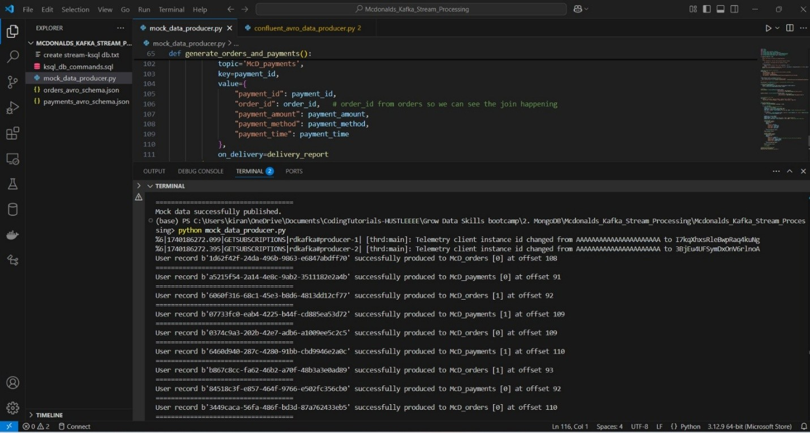
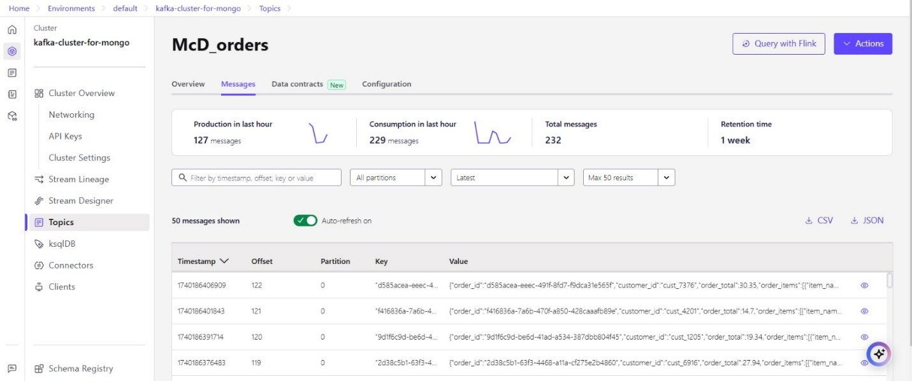
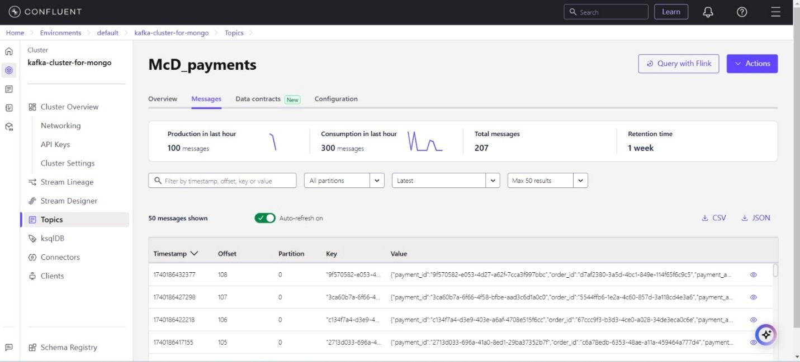
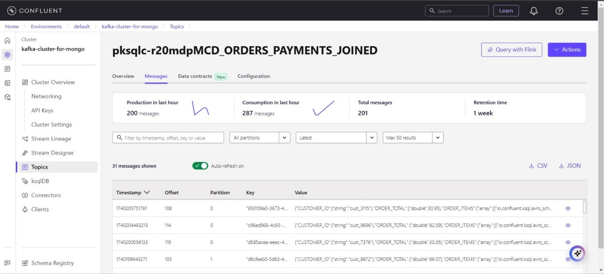
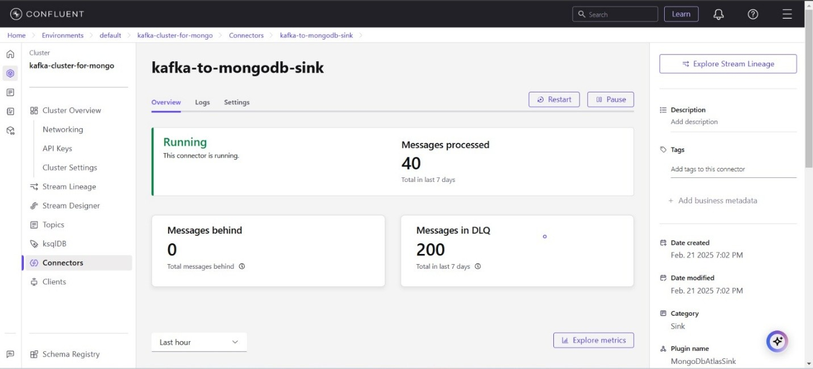
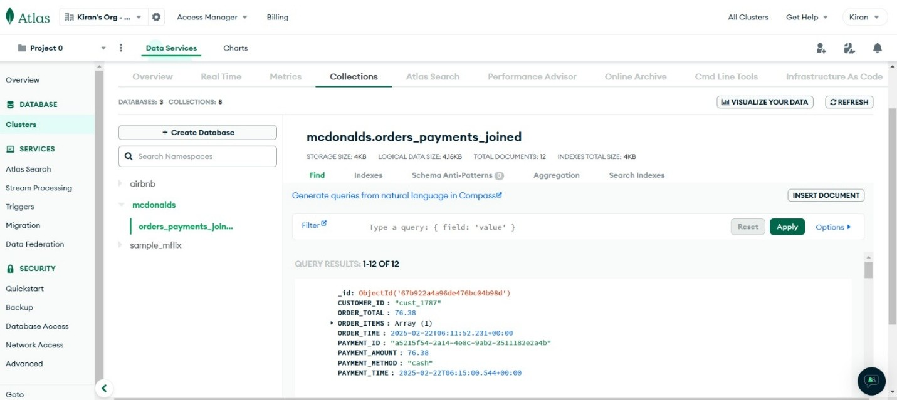

# McDonald's Real-time Order Processing Pipeline with Kafka, ksqlDB, and MongoDB Atlas

## Overview
This project demonstrates a real-time data pipeline for McDonald's order processing using Confluent Kafka, ksqlDB, and MongoDB Atlas. The pipeline ingests mock order and payment data, processes and joins it using ksqlDB, and stores the final results in MongoDB Atlas. Finally, the data is visualized using MongoDB Atlas Visualization.

## Features
- **Mock Data Generation**: Python script generates McDonald's order and payment data and serializes it into Avro format.
- **Kafka Integration**: Data is produced to Confluent Kafka topics (`mcd_orders` and `mc_producers`).
- **ksqlDB Processing**: Streams are created for both topics, and a third stream joins orders and payments data.
- **MongoDB Atlas Sink Connector**: The joined stream is stored in a MongoDB database.
- **Real-time Visualization**: MongoDB Atlas is used to visualize real-time data.

## Prerequisites
- Confluent Kafka (Cloud)
- MongoDB Atlas (Cloud)
- Python (for generating mock data)
- ksqlDB (for data processing)
- Confluent Kafka MongoDB Sink Connector

## Setup Steps
1. **Generate Mock Data**
   - Use a Python script to generate McDonald's order and payment data.
   - Serialize the data using Avro format.
   - Produce data to Confluent Kafka topics (`mcd_orders` and `mc_producers`).

2. **Create Kafka Streams in ksqlDB**
   - Define streams for orders and payments topics:
     
   - Create a joined stream from orders and payments streams:

3. **Connect Kafka to MongoDB Atlas**
   - Create a database and collection in MongoDB Atlas.
   - Configure Confluent Kafka MongoDB Sink Connector to store `joined_stream` data in MongoDB.

4. **Visualize Data in MongoDB Atlas**
   - Use MongoDB Atlas visualization tools to analyze order trends.

## Screenshots
Include screenshots of different stages:
- **Mock Data Generation**:  
  

- **Kafka Topic Data Flow**:  
  
  

- **ksqlDB Joined Stream Data**:  
  

- **Confluent Kafka MongoDB Sink Connector**:  
  

- **MongoDB Atlas Sink Data Collection**:  
  

- **MongoDB Atlas Visualization**:  
  

## Achievements
- Established a real-time data pipeline from data ingestion to storage and visualization.
- Used Kafka for event-driven streaming and ksqlDB for real-time processing.
- Integrated MongoDB Atlas for cloud-based storage and analytics.
- Created meaningful data visualizations to gain insights into order trends.

## Future Improvements
- Enhance Data Enrichment: Use Azure Data Factory or AWS Glue to add metadata during the ETL process.
- Real-Time Alerts: Implement alerts with Amazon CloudWatch or Power BI data alerts for specific order patterns.
- Front-End Dashboard: Deploy interactive dashboards in Power BI or Grafana for live data tracking from your data sources.
- Error Handling in Kafka: Improve error handling and data validation using Kafka Streams API and monitor with Prometheus for Grafana.
- Optimize MongoDB Queries: Use MongoDB's aggregation framework and connect with Power BI's DirectQuery for efficient performance.
- Explore Additional Connectors: Utilize Power BI Dataflows and Grafana plugins to integrate with a wider range of data sources.

## Conclusion
This project showcases the power of Kafka, ksqlDB, and MongoDB Atlas in building a real-time data processing pipeline. The setup efficiently handles data ingestion, processing, storage, and visualization, making it a great example of event-driven architecture.
